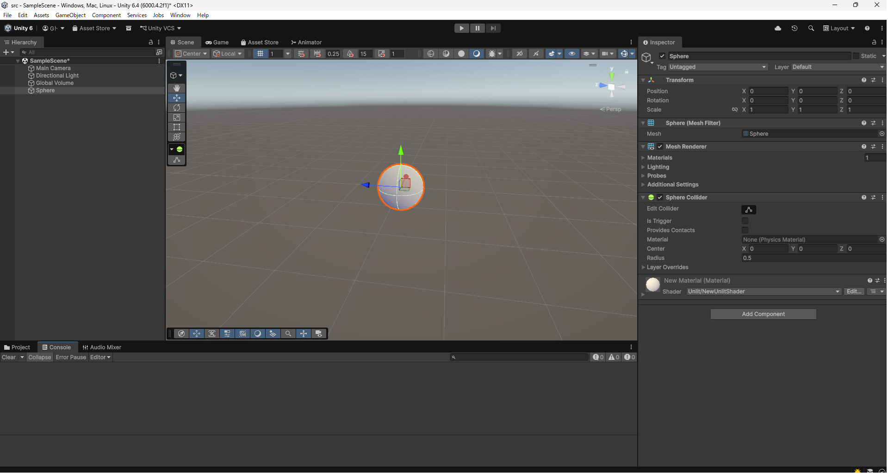
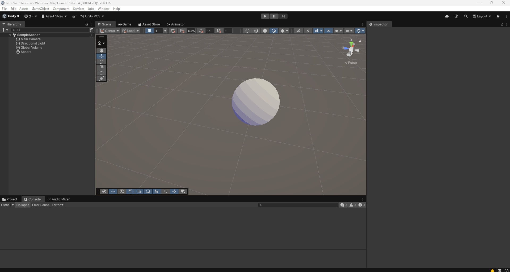

# はじめに
プログラムワークショップⅣの第2回の管理用です

# 結果画像

- 工夫した点：調べながら簡易的なトゥーン調のシェーダーの影を再現してみました。
- 一枚目が普通に影を表現してみた画像で、二枚目がトゥーン風にパキパキな影を表現した画像です。

- 
# 進め方

- 本リポジトリをforkしてください。
- fork先のリポジトリを更新してください
- Unityのプロジェクトをsrc内で進めて下さい。
- 結果を画面キャプチャして、画像としてリポジトリに追加して、上記のリンクから見れるようにしてください。
- 完成したら本リポジトリのmainブランチにpull requestを投げてください

